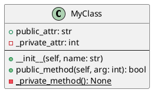

# MCP Docs Tools

A Node.js-based MCP (Model Context Protocol) tool server that provides three focused documentation generation tools for Python projects. Built as an npm package that can be installed directly from the Git repository.

## Features

### 🔧 Three Powerful Tools

1. **`create_class_diagram`** - Analyzes Python files and generates UML class diagrams in PlantUML format
2. **`create_tree_structure`** - Creates clean directory tree structure documentation with smart exclusions
3. **`create_module_functions`** - Documents module-level functions with signatures, decorators, and type hints

### 🚀 Key Benefits

- **Zero Configuration**: Works out of the box with sensible defaults
- **Smart Exclusions**: Automatically filters out cache, build, and IDE files
- **Rich Documentation**: Captures type hints, decorators, docstrings, and inheritance
- **MCP Integration**: Seamlessly integrates with AI assistants via Model Context Protocol
- **Hybrid Architecture**: Node.js orchestration + Python AST parsing for reliability

## Installation

### From Git Repository (Recommended)

```bash
# Clone the repository
git clone https://github.com/your-username/mcp-docs-tools.git
cd mcp-docs-tools

# Install dependencies
npm install

# Install globally (optional)
npm install -g .

# Or run directly
npm start
```

### Direct Installation from Git

```bash
# Install directly from GitHub
npm install -g git+https://github.com/your-username/mcp-docs-tools.git

# Then run
mcp-docs-tools
```

### Local Development

```bash
git clone https://github.com/your-username/mcp-docs-tools.git
cd mcp-docs-tools
npm install
npm start
```

## Requirements

- **Node.js** ≥18.0.0
- **Python** 3.x (for AST parsing)
- **Git** (for cloning the repository)

## Usage

### As MCP Server

Start the server to expose tools via Model Context Protocol:

```bash
# If installed globally
mcp-docs-tools

# Or from the project directory
npm start

# Or run directly with node
node bin/server.js
```

The server will listen on stdin/stdout and expose three tools that can be called by MCP clients.

### Tool Specifications

#### 1. create_class_diagram

**Purpose**: Generate UML class diagrams from Python code

**Parameters**:
- `project_path` (string, required): Root path of the Python project to analyze

**Output**: 
- File: `docs/uml.txt`
- Format: PlantUML syntax
- Content: Classes with public/private methods, attributes, and inheritance relationships

**Example**:


#### 2. create_tree_structure

**Purpose**: Generate project directory tree structure

**Parameters**:
- `project_path` (string, required): Root path of the project to analyze

**Output**:
- File: `docs/tree-structure.txt`
- Format: Unicode box-drawing tree
- Content: Complete file/directory structure with smart exclusions

**Example**:
```
my-project
├── src/
│   ├── main.py
│   └── utils/
│       └── helpers.py
├── tests/
│   └── test_main.py
└── README.md
```

#### 3. create_module_functions

**Purpose**: Document module-level functions and signatures

**Parameters**:
- `project_path` (string, required): Root path of the Python project to analyze

**Output**:
- File: `docs/module-functions.txt`
- Format: Hierarchical markdown documentation
- Content: Functions organized by module with full signatures, decorators, and docstrings

**Example**:
```markdown
## Module: src.utils.helpers

### `async def process_data(data: List[str], timeout: int = 30) -> Dict[str, Any]`

**Decorators:**
- `@retry(max_attempts=3)`

**Description:**
Process a list of data items with optional timeout.

**Line:** 42
```

## Architecture

### Hybrid Node.js + Python Approach

The tool uses a hybrid architecture that combines the best of both worlds:

- **Node.js Server**: Handles MCP protocol, tool registration, and process orchestration
- **Python Scripts**: Perform robust AST parsing and documentation generation
- **Clean Separation**: Protocol handling separate from parsing logic

### Project Structure

```
mcp-docs-tools/
├── package.json              # npm package configuration
├── bin/
│   └── server.js             # Main MCP server entry point
├── src/
│   ├── server.js             # MCP server implementation
│   ├── tools/                # Tool implementations
│   │   ├── class-diagram.js  # UML generation wrapper
│   │   ├── tree-structure.js # Tree generation wrapper
│   │   └── module-functions.js # Function docs wrapper
│   └── config/
│       └── exclusions.js     # Default exclusion patterns
├── python/
│   ├── generate_uml.py       # Python AST parsing for classes
│   ├── generate_tree.py      # Directory tree generation
│   ├── generate_functions.py # Function parsing and documentation
│   └── requirements.txt      # Python dependencies (none needed)
└── README.md
```

## Smart Exclusions

The tools automatically exclude common files and directories that shouldn't be documented:

### Python
- `__pycache__`, `*.pyc`, `*.pyo`, `*.pyd`
- `build`, `dist`, `eggs`, `*.egg-info`
- Virtual environments: `venv`, `.venv`, `env`, `virtualenv`

### Development Tools
- Version control: `.git`, `.svn`, `.hg`
- IDEs: `.idea`, `.vscode`, `.cursor`
- Testing: `.pytest_cache`, `.coverage`, `.tox`

### Build & Package Managers
- `node_modules`, `target`, `out`, `bin`
- `package-lock.json`, `yarn.lock`, `Pipfile.lock`

### OS & Temporary
- `.DS_Store`, `Thumbs.db`, `*.tmp`, `*.log`

## Integration with AI Assistants

### Cursor IDE

The configuration depends on how you installed the tools:

#### Option A: If you cloned the repository (Recommended method)

Create a `.cursorrules` file in your projects and add this to your Cursor MCP configuration:

```json
{
  "mcpServers": {
    "docs-tools": {
      "command": "node",
      "args": ["/path/to/mcp-docs-tools/bin/server.js"],
      "cwd": "/path/to/mcp-docs-tools"
    }
  }
}
```

**Replace `/path/to/mcp-docs-tools` with the actual path where you cloned the repository.**

For example:
- macOS/Linux: `"/Users/yourname/projects/mcp-docs-tools"`
- Windows: `"C:\\Users\\yourname\\projects\\mcp-docs-tools"`

#### Option B: If you installed globally with `npm install -g`

```json
{
  "mcpServers": {
    "docs-tools": {
      "command": "mcp-docs-tools"
    }
  }
}
```

#### .cursorrules file content (for any installation method)

Create this `.cursorrules` file in your Python projects:

```markdown
# Documentation Tools Integration

## Available MCP Tools
- `create_class_diagram` - Generate UML class diagrams  
- `create_tree_structure` - Generate directory tree
- `create_module_functions` - Document module functions

## Usage
Run these tools at session start to generate documentation in `docs/` directory.
Reference the generated files to understand codebase structure.

## Generated Files
- `docs/uml.txt` - PlantUML class diagrams
- `docs/tree-structure.txt` - Directory structure  
- `docs/module-functions.txt` - Function documentation
```

### Claude Desktop

#### Option A: If you cloned the repository (Recommended method)

Add to your Claude Desktop MCP configuration:

```json
{
  "mcpServers": {
    "docs-tools": {
      "command": "node",
      "args": ["/path/to/mcp-docs-tools/bin/server.js"],
      "cwd": "/path/to/mcp-docs-tools"
    }
  }
}
```

**Replace `/path/to/mcp-docs-tools` with the actual path where you cloned the repository.**

#### Option B: If you installed globally with `npm install -g`

```json
{
  "mcpServers": {
    "docs-tools": {
      "command": "mcp-docs-tools"
    }
  }
}
```

### Quick Setup Guide

1. **Clone and install** (recommended):
   ```bash
   git clone https://github.com/your-username/mcp-docs-tools.git
   cd mcp-docs-tools
   npm install
   ```

2. **Find your installation path**:
   ```bash
   pwd
   # Copy this path for your MCP configuration
   ```

3. **Update your MCP config** with the path from step 2

4. **Test the tools** in your Python projects!

## Error Handling

The tools include comprehensive error handling:

- **Python Process Failures**: Detailed error messages with stdout/stderr
- **Missing Dependencies**: Clear instructions for Python installation
- **File Permission Issues**: Graceful handling with informative messages
- **Invalid Project Paths**: Path validation before processing

## Performance

- **Lightweight**: Minimal memory footprint with short-lived Python processes
- **Fast**: Efficient AST parsing with smart file filtering
- **Scalable**: Handles large codebases with thousands of files
- **Concurrent**: Multiple tools can run simultaneously

## Contributing

1. Fork the repository
2. Create a feature branch
3. Make your changes
4. Add tests if applicable
5. Submit a pull request

## License

MIT License - see LICENSE file for details.

## Support

- **Issues**: Report bugs and feature requests on GitHub
- **Documentation**: Full API documentation available in the repository
- **Examples**: Sample projects and usage patterns in the examples directory

---

**Made with ❤️ for the Python development community** 