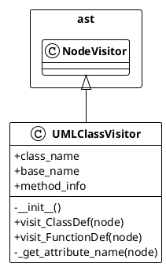

# MCP Docs Tools API Documentation

## Overview

The MCP Docs Tools server provides three powerful documentation generation tools via the Model Context Protocol (MCP). Each tool is designed to analyze Python projects and generate specific types of documentation.

## Available Tools

### 1. create_class_diagram

**Purpose**: Generate UML class diagrams from Python code using AST parsing.

**Parameters**:
- `project_path` (string, required): Root path of the Python project to analyze

**Output**:
- **File**: `docs/uml.txt`
- **Format**: PlantUML syntax
- **Content**: 
  - Class definitions with public/private methods and attributes
  - Type annotations and method signatures
  - Inheritance relationships
  - Static and class method indicators
  - Decorator information

**Example Output**:


**Use Cases**:
- Understanding class hierarchies and relationships
- Visualizing object-oriented architecture
- Code review and documentation
- Onboarding new developers

---

### 2. create_tree_structure

**Purpose**: Generate clean directory tree structure with intelligent exclusions.

**Parameters**:
- `project_path` (string, required): Root path of the project to analyze

**Output**:
- **File**: `docs/tree-structure.txt`
- **Format**: Unicode box-drawing tree structure
- **Content**: 
  - Complete file and directory hierarchy
  - Smart exclusions (node_modules, __pycache__, .git, etc.)
  - Statistics on files and directories processed

**Example Output**:
```
mcp-support-docs
├── bin/
│   └── server.js
├── docs/
│   ├── Design.md
│   ├── notes.md
│   └── task_list.md
├── python/
│   ├── generate_functions.py
│   ├── generate_tree.py
│   ├── generate_uml.py
│   └── requirements.txt
├── src/
│   ├── config/
│   ├── parsers/
│   ├── tools/
│   └── server.js
├── package.json
└── README.md

Statistics:
- Files: 1234
- Directories: 567
- Total items: 1801
```

**Use Cases**:
- Project structure overview
- File organization planning
- Documentation generation
- Build system configuration

---

### 3. create_module_functions

**Purpose**: Document module-level functions with complete signatures and metadata.

**Parameters**:
- `project_path` (string, required): Root path of the Python project to analyze

**Output**:
- **File**: `docs/module-functions.txt`
- **Format**: Structured markdown documentation
- **Content**: 
  - Module-level functions (excludes class methods)
  - Complete function signatures with type hints
  - Decorator information
  - Docstrings and descriptions
  - Line numbers for easy navigation
  - Import statements per module

**Example Output**:
```markdown
# Module Functions Documentation

## Module: generate_functions
**File:** `generate_functions.py`

**Imports:**
- argparse
- ast
- os
- sys
- typing.Any
- typing.Dict
- typing.List
- typing.Optional

**Functions:**

### `def parse_python_file(file_path: str) -> FunctionVisitor`

**Description:**
Parse a Python file and extract function information.

**Line:** 232

---

### `async def process_data(data: List[str], timeout: int = 30) -> Dict[str, Any]`

**Decorators:**
- `@retry(max_attempts=3)`
- `@cache`

**Description:**
Process a list of data items with optional timeout and caching.

**Line:** 156
```

**Use Cases**:
- API documentation generation
- Function discovery and reuse
- Code analysis and refactoring
- Developer onboarding

## Tool Integration Patterns

### Sequential Usage
```javascript
// 1. Generate tree structure for project overview
await mcp.callTool('create_tree_structure', { project_path: '/path/to/project' });

// 2. Generate class diagrams for architecture understanding
await mcp.callTool('create_class_diagram', { project_path: '/path/to/project' });

// 3. Generate function documentation for API reference
await mcp.callTool('create_module_functions', { project_path: '/path/to/project' });
```

### Conditional Usage
```javascript
// For Python projects with classes
if (hasClasses) {
  await mcp.callTool('create_class_diagram', { project_path });
}

// For projects with utility functions
if (hasModuleFunctions) {
  await mcp.callTool('create_module_functions', { project_path });
}

// Always useful for any project
await mcp.callTool('create_tree_structure', { project_path });
```

## Error Handling

All tools provide comprehensive error handling:

### Common Error Types
1. **Invalid Path**: Project path doesn't exist or isn't accessible
2. **Permission Denied**: Insufficient permissions to read files
3. **Python Process Failed**: Python script execution errors
4. **No Content Found**: No relevant content to document

### Error Response Format
```json
{
  "content": [{
    "type": "text",
    "text": "Error generating class diagram: Python process failed with code 1: Error: Root directory 'invalid/path' does not exist"
  }],
  "isError": true
}
```

## Performance Characteristics

### Processing Speed
- **Small projects** (< 100 files): < 1 second
- **Medium projects** (100-1000 files): 1-5 seconds  
- **Large projects** (1000+ files): 5-30 seconds

### Memory Usage
- **Node.js server**: ~10-20 MB baseline
- **Python processes**: ~5-15 MB per tool execution
- **Output files**: Typically < 1 MB each

### Scalability
- Tools process files sequentially for reliability
- Memory usage scales linearly with project size
- No persistent state between tool calls

## Configuration and Customization

### Default Exclusions
The tools automatically exclude common files and directories:

**Python-specific**:
- `__pycache__/`, `*.pyc`, `*.pyo`
- `.pytest_cache/`, `.coverage`
- `venv/`, `.venv/`, `env/`

**General development**:
- `.git/`, `.svn/`, `.hg/`
- `node_modules/`, `dist/`, `build/`
- IDE files (`.vscode/`, `.idea/`)

**Temporary files**:
- `*.tmp`, `*.temp`, `*.log`
- `*.swp`, `*.swo`, `*~`

### Output Locations
All tools output to the `docs/` directory within the specified project path:
- `{project_path}/docs/uml.txt`
- `{project_path}/docs/tree-structure.txt`
- `{project_path}/docs/module-functions.txt`

## Best Practices

### 1. Project Path Selection
- Use absolute paths for reliability
- Point to the project root directory
- Ensure the path contains Python files for class/function tools

### 2. Documentation Workflow
1. Start with `create_tree_structure` for project overview
2. Use `create_class_diagram` for OOP-heavy projects
3. Use `create_module_functions` for utility-heavy projects
4. Regenerate after significant code changes

### 3. Integration Tips
- Call tools in parallel for independent projects
- Cache results and regenerate only when needed
- Use tree structure to understand before diving deeper

### 4. Output Management
- Commit generated docs to version control
- Set up CI/CD to regenerate docs automatically
- Use docs as input for other documentation tools

## Troubleshooting

### Common Issues

**"Python process failed"**
- Ensure Python 3.x is installed and accessible as `python3`
- Check that the project path exists and is readable
- Verify the project contains Python files

**"No classes/functions found"**
- Confirm the project contains Python files
- Check that files aren't excluded by default patterns
- Verify Python syntax is valid

**"Permission denied"**
- Ensure read permissions on the project directory
- Check write permissions for the docs output directory
- Run with appropriate user privileges

### Debug Mode
Enable verbose logging by setting environment variables:
```bash
DEBUG=mcp-docs-tools npm start
```

### Manual Testing
Test individual Python scripts directly:
```bash
cd python/
python3 generate_uml.py --root /path/to/project --output /path/to/output
python3 generate_tree.py --root /path/to/project --output /path/to/output
python3 generate_functions.py --root /path/to/project --output /path/to/output
``` 