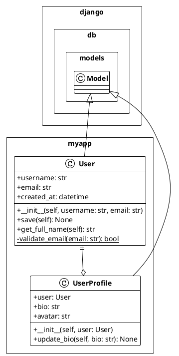

# MCP Docs Tools Usage Guide

## Quick Start

### 1. Installation and Setup

```bash
# Clone the repository
git clone https://github.com/your-username/mcp-docs-tools.git
cd mcp-docs-tools

# Install dependencies
npm install

# Start the MCP server
npm start
```

The server will start and listen on stdin/stdout for MCP protocol messages.

### 2. Basic Tool Usage

Once the MCP server is running, you can call the tools through any MCP-compatible client:

```javascript
// Generate all documentation for a Python project
await mcp.callTool('create_tree_structure', { 
  project_path: '/path/to/your/python/project' 
});

await mcp.callTool('create_class_diagram', { 
  project_path: '/path/to/your/python/project' 
});

await mcp.callTool('create_module_functions', { 
  project_path: '/path/to/your/python/project' 
});
```

## Detailed Usage Examples

### Example 1: Documenting a Django Project

**Project Structure:**
```
my-django-app/
├── manage.py
├── myapp/
│   ├── __init__.py
│   ├── models.py
│   ├── views.py
│   ├── urls.py
│   └── utils.py
├── tests/
│   └── test_models.py
└── requirements.txt
```

**Step 1: Generate Tree Structure**
```javascript
await mcp.callTool('create_tree_structure', { 
  project_path: '/home/user/my-django-app' 
});
```

**Output:** `docs/tree-structure.txt`
```
my-django-app
├── manage.py
├── myapp/
│   ├── __init__.py
│   ├── models.py
│   ├── views.py
│   ├── urls.py
│   └── utils.py
├── tests/
│   └── test_models.py
└── requirements.txt

Statistics:
- Files: 8
- Directories: 2
- Total items: 10
```

**Step 2: Generate Class Diagrams**
```javascript
await mcp.callTool('create_class_diagram', { 
  project_path: '/home/user/my-django-app' 
});
```

**Output:** `docs/uml.txt`


**Step 3: Generate Function Documentation**
```javascript
await mcp.callTool('create_module_functions', { 
  project_path: '/home/user/my-django-app' 
});
```

**Output:** `docs/module-functions.txt`
```markdown
# Module Functions Documentation

## Module: myapp.utils
**File:** `myapp/utils.py`

**Imports:**
- datetime
- typing.Dict
- typing.List
- typing.Optional

**Functions:**

### `def format_date(date: datetime.datetime, format_str: str = '%Y-%m-%d') -> str`

**Description:**
Format a datetime object to a string representation.

**Line:** 15

---

### `def validate_user_data(data: Dict[str, Any]) -> bool`

**Decorators:**
- `@cache`

**Description:**
Validate user registration data.

**Line:** 28

---

## Module: myapp.views
**File:** `myapp/views.py`

**Functions:**

### `def get_user_context(request: HttpRequest) -> Dict[str, Any]`

**Description:**
Get context data for user-related views.

**Line:** 45
```

### Example 2: Analyzing a Data Science Project

**Project Structure:**
```
ml-project/
├── data/
│   ├── raw/
│   └── processed/
├── src/
│   ├── data_processing.py
│   ├── model_training.py
│   ├── evaluation.py
│   └── utils/
│       ├── __init__.py
│       ├── preprocessing.py
│       └── visualization.py
├── notebooks/
│   ├── exploration.ipynb
│   └── analysis.ipynb
├── tests/
└── requirements.txt
```

**Generate Documentation:**
```javascript
// Get project overview
await mcp.callTool('create_tree_structure', { 
  project_path: '/home/user/ml-project' 
});

// Document utility classes and data structures
await mcp.callTool('create_class_diagram', { 
  project_path: '/home/user/ml-project' 
});

// Document processing functions and APIs
await mcp.callTool('create_module_functions', { 
  project_path: '/home/user/ml-project' 
});
```

**Key Benefits for Data Science:**
- **Function Discovery**: Find reusable preprocessing functions
- **Pipeline Visualization**: Understand data flow through class diagrams
- **API Documentation**: Document model training and evaluation functions

### Example 3: Microservice Documentation

**Project Structure:**
```
user-service/
├── app/
│   ├── __init__.py
│   ├── main.py
│   ├── models/
│   │   ├── __init__.py
│   │   ├── user.py
│   │   └── auth.py
│   ├── services/
│   │   ├── __init__.py
│   │   ├── user_service.py
│   │   └── auth_service.py
│   └── api/
│       ├── __init__.py
│       ├── routes.py
│       └── middleware.py
├── tests/
├── docker/
└── requirements.txt
```

**Documentation Workflow:**
```javascript
// 1. Understand service structure
await mcp.callTool('create_tree_structure', { 
  project_path: '/home/user/user-service' 
});

// 2. Map domain models and relationships
await mcp.callTool('create_class_diagram', { 
  project_path: '/home/user/user-service' 
});

// 3. Document API endpoints and business logic
await mcp.callTool('create_module_functions', { 
  project_path: '/home/user/user-service' 
});
```

## Advanced Usage Patterns

### 1. Continuous Documentation

**Setup automated documentation generation:**

```bash
#!/bin/bash
# docs-update.sh

PROJECT_PATH="/path/to/project"
MCP_SERVER="mcp-docs-tools"

echo "Updating project documentation..."

# Start MCP server in background
$MCP_SERVER &
MCP_PID=$!

# Wait for server to start
sleep 2

# Generate documentation (pseudo-code for MCP client)
mcp-client call create_tree_structure --project_path="$PROJECT_PATH"
mcp-client call create_class_diagram --project_path="$PROJECT_PATH"
mcp-client call create_module_functions --project_path="$PROJECT_PATH"

# Stop MCP server
kill $MCP_PID

echo "Documentation updated in $PROJECT_PATH/docs/"
```

### 2. Selective Documentation

**Generate only specific documentation types:**

```javascript
// For projects with primarily functional code
if (projectType === 'functional') {
  await mcp.callTool('create_module_functions', { project_path });
  await mcp.callTool('create_tree_structure', { project_path });
}

// For object-oriented projects
if (projectType === 'oop') {
  await mcp.callTool('create_class_diagram', { project_path });
  await mcp.callTool('create_tree_structure', { project_path });
}

// For mixed projects
if (projectType === 'mixed') {
  await mcp.callTool('create_tree_structure', { project_path });
  await mcp.callTool('create_class_diagram', { project_path });
  await mcp.callTool('create_module_functions', { project_path });
}
```

### 3. Multi-Project Documentation

**Document multiple related projects:**

```javascript
const projects = [
  '/path/to/backend-service',
  '/path/to/data-pipeline',
  '/path/to/ml-models'
];

for (const projectPath of projects) {
  console.log(`Documenting ${projectPath}...`);
  
  await mcp.callTool('create_tree_structure', { project_path: projectPath });
  await mcp.callTool('create_class_diagram', { project_path: projectPath });
  await mcp.callTool('create_module_functions', { project_path: projectPath });
  
  console.log(`Documentation generated in ${projectPath}/docs/`);
}
```

## Integration Examples

### 1. VS Code Extension Integration

```typescript
// VS Code extension example
import * as vscode from 'vscode';
import { McpClient } from '@modelcontextprotocol/sdk/client';

export function activate(context: vscode.ExtensionContext) {
  const disposable = vscode.commands.registerCommand(
    'extension.generateDocs',
    async () => {
      const workspaceFolder = vscode.workspace.workspaceFolders?.[0];
      if (!workspaceFolder) return;
      
      const projectPath = workspaceFolder.uri.fsPath;
      
      // Connect to MCP server
      const client = new McpClient();
      await client.connect();
      
      // Generate documentation
      await client.callTool('create_tree_structure', { project_path: projectPath });
      await client.callTool('create_class_diagram', { project_path: projectPath });
      await client.callTool('create_module_functions', { project_path: projectPath });
      
      vscode.window.showInformationMessage('Documentation generated!');
    }
  );
  
  context.subscriptions.push(disposable);
}
```

### 2. CI/CD Pipeline Integration

```yaml
# .github/workflows/docs.yml
name: Generate Documentation

on:
  push:
    branches: [ main ]
  pull_request:
    branches: [ main ]

jobs:
  generate-docs:
    runs-on: ubuntu-latest
    
    steps:
    - uses: actions/checkout@v3
    
    - name: Setup Node.js
      uses: actions/setup-node@v3
      with:
        node-version: '18'
    
    - name: Setup Python
      uses: actions/setup-python@v4
      with:
        python-version: '3.x'
    
    - name: Install MCP Docs Tools
      run: |
        git clone https://github.com/your-username/mcp-docs-tools.git
        cd mcp-docs-tools
        npm install
    
    - name: Generate Documentation
      run: |
        cd mcp-docs-tools
        # Start MCP server and generate docs
        # (Implementation depends on your MCP client setup)
        
    - name: Commit Documentation
      run: |
        git config --local user.email "action@github.com"
        git config --local user.name "GitHub Action"
        git add docs/
        git diff --staged --quiet || git commit -m "Auto-update documentation"
        git push
```

### 3. Pre-commit Hook Integration

```bash
#!/bin/sh
# .git/hooks/pre-commit

echo "Generating documentation..."

# Check if Python files were modified
if git diff --cached --name-only | grep -q "\.py$"; then
    # Start MCP server and generate docs
    cd /path/to/mcp-docs-tools
    npm start &
    MCP_PID=$!
    
    # Generate documentation
    # (MCP client calls here)
    
    # Stop server
    kill $MCP_PID
    
    # Add generated docs to commit
    git add docs/
fi

exit 0
```

## Best Practices

### 1. Documentation Workflow

**Recommended Order:**
1. **Tree Structure First**: Understand project layout
2. **Class Diagrams**: Map object relationships
3. **Function Documentation**: Detail API interfaces

**Frequency:**
- **On Major Changes**: Significant refactoring or new features
- **Before Releases**: Ensure documentation is current
- **Weekly/Monthly**: Regular maintenance updates

### 2. Output Management

**Version Control:**
```bash
# Add docs to git
git add docs/
git commit -m "Update project documentation"

# Create documentation tags
git tag -a docs-v1.0 -m "Documentation snapshot v1.0"
```

**Documentation Reviews:**
- Review generated docs for accuracy
- Supplement with manual documentation where needed
- Use docs as input for other documentation tools

### 3. Team Collaboration

**Shared Documentation:**
- Commit generated docs to shared repository
- Use docs in code reviews and planning
- Reference docs in pull request descriptions

**Documentation Standards:**
- Establish team conventions for doc updates
- Include documentation checks in code review process
- Automate documentation generation where possible

## Troubleshooting Common Issues

### Issue 1: "No Python files found"

**Symptoms:**
- Tools complete but generate empty documentation
- "No classes/functions found" messages

**Solutions:**
```bash
# Check project structure
ls -la /path/to/project/**/*.py

# Verify Python files are valid
python3 -m py_compile /path/to/project/file.py

# Check exclusion patterns aren't too aggressive
```

### Issue 2: "Permission denied"

**Symptoms:**
- Tools fail with permission errors
- Cannot write to docs directory

**Solutions:**
```bash
# Check directory permissions
ls -la /path/to/project/

# Create docs directory if needed
mkdir -p /path/to/project/docs

# Fix permissions
chmod 755 /path/to/project/docs
```

### Issue 3: "Python process failed"

**Symptoms:**
- Tools fail with Python execution errors
- Syntax errors in Python files

**Solutions:**
```bash
# Test Python scripts directly
cd python/
python3 generate_uml.py --root /path/to/project --output /tmp/test

# Check Python version
python3 --version

# Verify Python installation
which python3
```

### Issue 4: Large project performance

**Symptoms:**
- Tools take very long to complete
- High memory usage

**Solutions:**
- Use more specific project paths (subdirectories)
- Check for large files being included
- Monitor system resources during execution

## Tips and Tricks

### 1. Efficient Project Analysis

**Focus on Specific Directories:**
```javascript
// Instead of entire project
await mcp.callTool('create_class_diagram', { 
  project_path: '/large/project' 
});

// Focus on specific modules
await mcp.callTool('create_class_diagram', { 
  project_path: '/large/project/src/core' 
});
```

### 2. Documentation Maintenance

**Regular Updates:**
- Set up automated documentation generation
- Include docs in your definition of done
- Review docs during code reviews

**Quality Checks:**
- Verify generated UML renders correctly
- Check function signatures match implementation
- Ensure tree structure reflects current state

### 3. Integration with Other Tools

**PlantUML Integration:**
```bash
# Convert UML to images
plantuml docs/uml.txt

# Generate SVG
plantuml -tsvg docs/uml.txt
```

**Documentation Sites:**
- Include generated docs in Sphinx/MkDocs
- Use tree structure for navigation
- Reference function docs in API documentation 